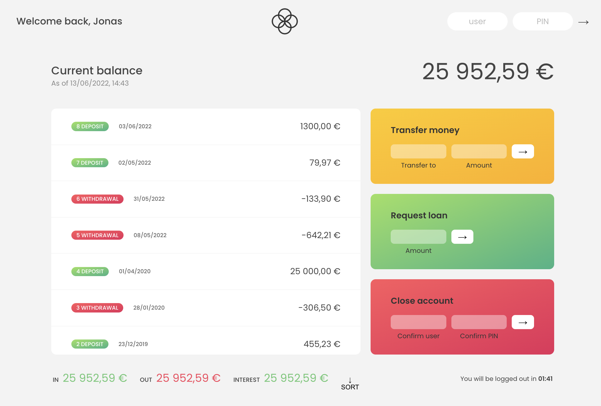

# BANKIST

<br>

Minimalist online banking app, made as a part of the [Jonas Smedtmann's JavaScript course](https://www.udemy.com/course/the-complete-javascript-course/learn/lecture/22648713#notes).

<br><br>

---

<br>

**mockup**

<br>



<br><br>

---

<br>

## Technologies

<br>

- HTML, CSS
- JavaScript

<br><br>

---

<br>

**flowchart**

<br>


<br><br>

---

<br>

## Content

<br>

1. [Intro](#1-intro)
2. [Creating DOM elements](#2-creating-dom-elements)
3. [Computing usernames](#3-computing-usernames)
4. [Implementing Login](#4-implementing-login)

<br><br>

---

<br>

## 1. Intro

<br>

**Part I:**
<br>

- display of movements

- enabling Transfer money, Request loan, Close account operations

- calculating statistics

- current balance

<br>

We will use **objects instead of maps** because we will simulate that the **data comes from Web API**.

Data from Web API comes as objects.

<br><br>

opacity: 0 >> element is invisible

opacity: 100 >> element is visible
<br>

Log in/out changes the opacity (JS).

<br><br>

---

<br>

## 2. Creating DOM elements

<br>

### Displaying movements

<br>

- each movements has one element

- with `forEach()` we loop through `movements` array, each iteration displays one element for each movement
  <br><br>

- good practice is to create a function and pass the data in instead of have the function work with a global variable
  <br><br>

- create **HTML template with template literal**

- add `movements` data
  <br><br>

- attach created HTML template to the `movements` container with `insertAdjacentHTML()` method

- new movements are added on top with `afterbegin` >> inverted with `beforeend`
  <br><br>

### Adding new elements

<br>

- first, empty the container: `containerMovements.innerHTML = "";`

<br><br>

```js
const account1 = {
  owner: 'Jonas Schmedtmann',
  movements: [200, 450, -400, 3000, -650, -130, 70, 1300],
  interestRate: 1.2, // %
  pin: 1111,
};

// display of movements
const displayMovements = function (movements) {
  // empty the container to add new elements
  containerMovements.innerHTML = '';

  movements.array.forEach(function(mov, i) => {

    // check if deposit or withdrawal
    const depositType = mov > 0 ? 'deposit' : 'withdrawal';

    // creating one row of movements
    const html = `
      <div class="movements__row">
        <div
          class="movements__type movements__type--${depositType}">
          ${i + 1} ${depositType}
        </div>
        <div class="movements__value">${mov}</div>
      </div>`;

    // attach HTML template to movements element
    containerMovements.insertAdjacentHTML('afterbegin', html);
  });
};
```

<br><br>

`insertAdjacentHTML(1, 2)`
<br><br>

Accepts 2 strings:

- 1: **position** at which we want to attach the HTML

- 2: **text**, string containing HTML we want to insert
  <br><br>

      containerMovements.insertAdjacentHTML('afterbegin', html);

  <br>

[MDN insertAdjacentHTML](https://developer.mozilla.org/en-US/docs/Web/API/Element/insertAdjacentHTML)

<br><br>

`textContent` VS `innerHTML`

<br>

- `textContent` returns only the text

- `innerHTML` returns everything, including the HTML (included all HTML tags)

<br><br>

    console.log(containerMovements.innerHTML); // displays complete HTML

---

<br>

## 3. Computing usernames

<br>

`map()` and `forEach()` for computing user names for each account owner in the app
<br><br>

**We will create a side-efect.**
When we modify something, in JavaScript, we cause side effects. This simply means modifying or changing our code, causing it to have unpredictable behaviour and mutability.

We will be producing a side-effect/are doing something to the account object. We won't return a new value.
<br><br>

**username** = initials of each of the users
<br>

`" "` = space

`""` = empty string
<br><br>

**Steps:**
<br>

1. transform the string to lowercase: `toLowerCase()`

2. to take only 1st letters of each word, split string into multiple words with `split(" ")`, dividing by spaces

3. loop over the array with `map()`, take only first letter and join the strings with `join("")` with empty string
   <br><br>

```js
const user = 'Steven Thomas Williams'; // stw

const username = user
  .toLowerCase()
  .split(' ')
  .map(word => word[0])
  .join('');
console.log(username); // stw
```

<br><br>

We'll make a function out of it:
<br>

```js
const createUsernames = function (user) {
  const username = user
    .toLowerCase()
    .split(' ')
    .map(word => word[0])
    .join('');

  console.log(username);
};
createUsernames('Jonas Schmedtmann'); //js
```

<br><br>

_Compute 1 username for each of account holders in the accounts array._
<br>

    const accounts = [account1, account2, account3, account4];

<br><br>

We do not want to create a new array (no `map()`), we want to modify the existing elements in accounts array >> `forEach()`
<br>

- receive all the accounts (array of accounts)

- create a new property on all objects: `username`
  <br><br>

```js
const createUsernames = function (accs) {
  // side-effects: mutating original array
  accs.forEach(function (acc) {
    acc.username = acc.owner // new property on objects
      .toLowerCase()
      .split(' ')
      .map(word => word[0])
      .join('');
  });
};

createUsernames(accounts);
```

<br><br>

**We don't return anything, we are producing a side-effect/are doing something to the `account` object.**

We don't use arrow function because we are not creating a value to be returned.

<br><br>

---

<br>

## 4. Implementing Login

<br>

When a `button` is in `form` element, the HTML default behaviour is to **reload when that kind of button is clicked.**
<br><br>

To stop that from happening, do this:
<br>

```js
btnLogin.addEventListener('click', function (e) {
  // prevents form from submitting
  e.preventDefault();

  console.log('Login');
});
```

<br><br>

Whenever there is `input` field + we hit `enter`, it will automatically trigger `click` event on submit button.

<br><br>

`preventDefault()` method
<br><br>

The `preventDefault()` method tells the user agent that if the event does not get explicitly handled, its default action should not be taken as it normally would be.

The event continues to propagate as usual, unless one of its event listeners calls `stopPropagation()` or `stopImmediatePropagation()`, either of which terminates propagation at once.

Calling `preventDefault()` for a non-cancelable event, without specifying `cancelable: true` has no effect.
<br><br>

**Syntax**: `event.preventDefault();`
<br><br>

**Examples**:
<br><br>

- [Blocking default click handling](https://developer.mozilla.org/en-US/docs/Web/API/Event/preventDefault#blocking_default_click_handling)

- [Stopping keystrokes from reaching an edit field](https://developer.mozilla.org/en-US/docs/Web/API/Event/preventDefault#stopping_keystrokes_from_reaching_an_edit_field)

<br><br>

To login an user, we need to find the account with the user name that the user inputed. >> `find()`.
<br><br>

1.  select the element + read its value: `inputLoginUsername.value`

2.  save it to a variable defined outside of the event listener function because **we will need the information about current account in other functions**
    <br><br>

```js
let currentAccount;

btnLogin.addEventListener('click', function (e) {
  e.preventDefault();

  // find account with user name that user inputed
  currentAccount = accounts.find(acc => acc.owner === inputLoginUsername.value);
});
```

<br><br>

3. check if pin is correct.
   <br><br>

Convert `.value` to `Number()` because it will otherwise always be a string.

Also, check if the currentAccount exists. There are 2 ways:
<br>

a) `currentAccount && currentAccount.pin === Number(inputLoginPin.value)`

b) `currentAccount?.pin === Number(inputLoginPin.value)` (optional chaining)
<br><br>

Displaying only the first name of the user: `currentAccount.owner.split(" ")[0]`

<br><br>

**IF THE PIN IS CORRECT...**
<br><br>

```js
if (currentAccount?.pin === Number(inputLoginPin.value)) {
  // code
}
```

<br><br>

**1. Display UI and "welcome" msg**
<br><br>

```js
// .welcome; "Login to get started" = labelWelcome
labelWelcome.textContent = `Welcome back, ${
  currentAccount.owner.split(' ')[0]
}`;

// .app contains opacity to change visibility = containerApp
containerApp.style.opacity = 100;
```

<br><br>

**1.b Clear input fields**
<br><br>

    inputLoginUsername.value = inputLoginPin.value = '';

<br><br>

**2. Display movements**
<br><br>

Remove from the beginning and put it inside of the event handler.
<br>

    displayMovements(currentAccount.movements);

<br><br>

**3. Display balance**
<br><br>

    calcDisplayBalance(currentAccount.movements);

<br><br>

**4. Display summary**
<br><br>

    calcDisplaySummary(currentAccount.movements);

<br><br>

`blur()` function removes focus from a(n input) field.

<br><br>

**Changing interest rate for each account**
<br><br>

- we want to use the interest rate dynamically, depending on the current user

`calcDisplaySummary()` modification: instead of movements as parameter, we need account

<br><br>

---

##
